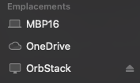

## Install script

You can use the install script in container or WSL

```bash
curl -sS https://raw.githubusercontent.com/igorovic/wsl-init/main/setup.sh | /bin/bash
```

**run only updates**

```bash
curl -sS https://raw.githubusercontent.com/igorovic/wsl-init/main/setup.sh | /bin/bash -s -- -u
```

## WSL setup

Download the desired tarball here `https://cloud-images.ubuntu.com/wsl/`

```powershell
wsl.exe --import <Distribution Name> <Install Folder> <.TAR.GZ File Path>
```

### Share env variables with wsl

```powershell
$Env:GIT_USERNAME=(git config user.username || 'igorovic')
$Env:GIT_USER_NAME=(git config user.name)
$Env:GIT_USER_EMAIL=(git config user.email)
$Env:WSLENV+=":GIT_USERNAME/u:GIT_USER_NAME/u:GIT_USER_EMAIL/u"
wsl -d <you-distro>
```

**explanations**

- First we set the environment variables withing powershell
- Then we tell wsl which environment variables from host are shared with WSL disto.
  - This is done with `WSLENV` env variable. Values are separated by column `:`. The suffix `/u` defines that this variable is shared only if we call wsl from windows.
  - !IMPORTANT: Note that we set the names of the environement variables and not the values within `WSLENV`.

[WSLENV ref](https://devblogs.microsoft.com/commandline/share-environment-vars-between-wsl-and-windows/)

## Docker container setup

### Build

```bash
# UID is necessary to grant access to ssh-agent socket
docker build -t dyve/ubuntu-dev-base:latest --progress plain --build-arg "UID=${UID}" --file ./Docker/ubuntu-dev-base.Dockerfile .
# Build for nodejs with pnpm store from host
docker build -t dyve/nodejs-dev:latest --progress plain --file ./Docker/nodejs.Dockerfile .
```

### Start container

```bash
# FIRST RUN: container does not exists -- this will create the container
docker run -it --name ubuntu-dev -p 3000-3020:3000-3020 \
--mount type=bind,source=./,target=/home/vscode/dev \
-e SSH_AUTH_SOCK=/ssh-agent -v "${SSH_AUTH_SOCK}:/ssh-agent" \
-e GIT_USER_EMAIL="$(git config user.email)" \
-e GIT_USER_NAME="$(git config user.name)" \
dyve/ubuntu-dev-base:latest
# if container already exists
docker start -ia ubuntu-dev
```

#### nodejs dev

For node I prefer `pnpm` package manager to reduce overall disk uage.
Since `pnpm` use a global store with hardlinks we need to create external docker volumes. This will help share the same pnpm store between multiple containers.

**create volumes**

```bash
# global shared cache
docker volume create pnpm-store
# store for globally installed packages
docker volume create pnpm-home
# vscode-server for extensions in container and stuff
docker volume create vscode-server
```

Docker volumes are managed by the docker daemon. Your docker daemon decides the disk location on your host machine.
To find out the disk location run `docker volume inspect pnpm-store`

Orbstack volumes [see notes below](#orbstack-volumes)

```bash
docker run -it --name node-dev -p 3000-3020:3000-3020 -p 5173:5173 -p 4321:4321 \
--mount type=volume,source=pnpm-store,target=/home/vscode/.pnpm-store/v3 \
--mount type=volume,source=pnpm-home,target=/home/vscode/.local/share/pnpm \
--mount type=volume,source=vscode-server,target=/home/vscode/.vscode-server \
--mount type=volume,source=projects,target=/home/vscode/projects \
-e SSH_AUTH_SOCK=/ssh-agent -v "${SSH_AUTH_SOCK}:/ssh-agent" \
-e GIT_USER_EMAIL="$(git config user.email)" \
-e GIT_USER_NAME="$(git config user.name)" \
dyve/nodejs-dev:latest
```

**To restart container when need to change source of `SSH_AUTH_SOCK`**

```bash
docker commit --message "change env vars" <container> <image:tag> \
&& docker rm <container> \
&& docker run -it --name <container> -e SSH_AUTH_SOCK=/ssh-agent -v "${SSH_AUTH_SOCK}:/ssh-agent" <image:tag>
```

#### Bun

```bash
docker run -it --rm --name bun \
--mount type=bind,source=./,target=/home/vscode/dev \
--mount type=volume,source=vscode-server,target=/home/vscode/.vscode-server \
-e SSH_AUTH_SOCK=/ssh-agent -v "${SSH_AUTH_SOCK}:/ssh-agent" \
-e GIT_USER_EMAIL="$(git config user.email)" \
-e GIT_USER_NAME="$(git config user.name)" \
dyve/bun:latest
```

#### tauri dev

```bash
docker run -it --name tauri-dev -p 5900:5900 \
--mount type=bind,source=./,target=/home/vscode/dev \
--mount type=volume,source=vscode-server,target=/home/vscode/.vscode-server \
-e SSH_AUTH_SOCK=/ssh-agent -v "${SSH_AUTH_SOCK}:/ssh-agent" \
-e GIT_USER_EMAIL="$(git config user.email)" \
-e GIT_USER_NAME="$(git config user.name)" \
-e DISPLAY=:0
dyve/tauri:v0
```

## Tmux

First time you start tmux `tpm` plugin is not automatically installed. You need to

- open tmux `tmux`
- Use `<leader>I` which sould be `Ctrl-s I` - this will install the plugin

## Neovim config

The nvim lua files go inside `~/.config/nvim/`

## Terminal Setup

### Nerd fonts

For nerd fonts you need to install the patched versions on your host. (Not in the container or WSL)

Then configure the nerd font in your terminal. This step depends on your terminal app.

### Mouse reporting

You need to enable mouse reporting in your terminal if you want to resize tmux panels with your mouse.

## VIM healthcheck

Show usefull information about your environment.

```vimcmd
:checkhealth
```

### Colors issues in Tmux

Some nvim plugin uses `TERM` environment variable so I had to manually define it inside a Docker container to fix colors issues.

```bash
export TERM=xterm-256color
```

The following tmux options where not sufficient.

```bash
# ~/.tmux.conf
set -g default-terminal "screen-256color"
set-option -sa terminal-features ',xterm-256color:RGB'
```

## Security

Use `gpg` and [`pass`](https://www.passwordstore.org/).

**initialize gpg keys**

```bash
# This will ask for a passphrase which will be your master password
gpg --full-generate-key
```

**initialize password-store**

```bash
# show your gpg id - will use this id to configure password-store
gpg -k
pass init <your gpg id - output by gpg -k>
```

## Misc Notes

### Orbstack volumes

When using Orbstack for containerization the docker volumes are created in a VM and mounted as a MAC OS volume. You can see the Orbastack volume in finder while Orbstack app is running.

`docker volume inspect` may report disk location as `/var/lib/docker` but with Orbstack this is actually inside `Orbstack VM`.


